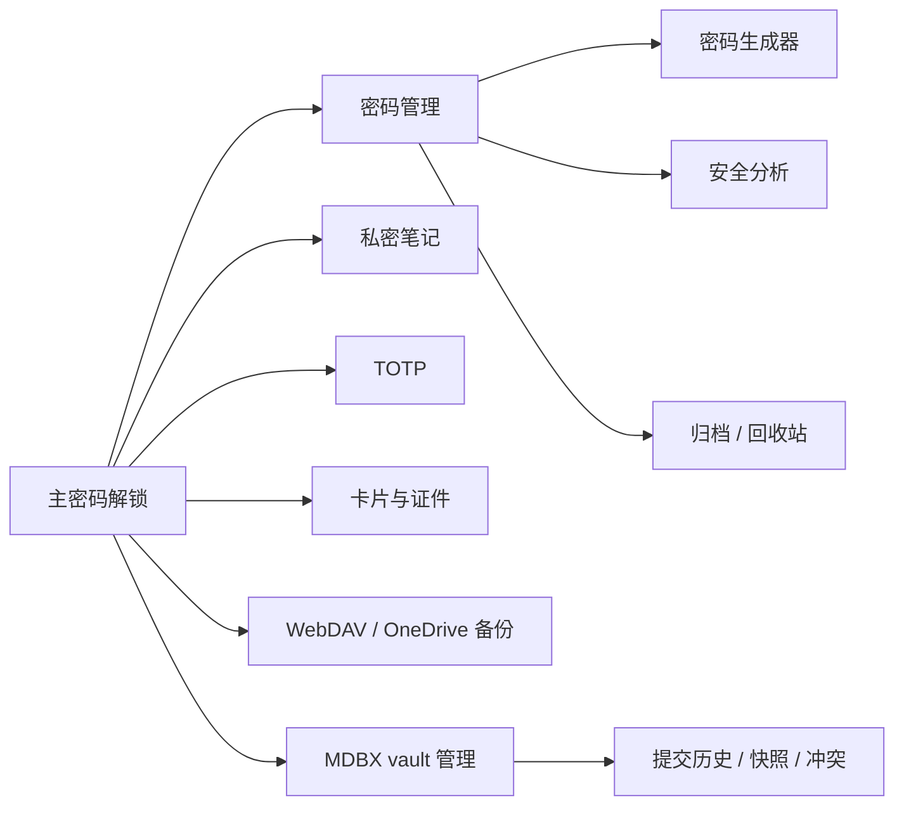
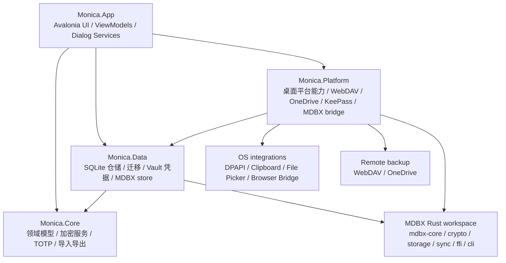

<h1 align="center">Monica by Avalonia</h1>

<div align="center">


**Monica by Avalonia：用 Avalonia、.NET 与 MDBX 打造本地优先的跨平台密码库。**

Windows / macOS / Linux · Local Vault · MDBX-1 · KeePass · TOTP · WebDAV / OneDrive


</div>

---

## 项目定位

Monica by Avalonia 是 Monica 密码库的桌面端实现，目标是在桌面平台上延续 Monica 的本地优先、安全优先和跨生态兼容路线。

围绕密码、TOTP、私密笔记、银行卡/证件、附件、导入导出、同步备份和 MDBX vault 管理构建的桌面应用。

本项目参考了现有 [Monica](https://github.com/Monica-Pass/Monica) 的产品方向，并接入 [MDBX](https://github.com/Monica-Pass/Mdbx) 的本地优先 vault 格式。MDBX 负责长期可维护的数据结构、类 Git 的逻辑历史、冲突处理、快照恢复和 Tiga 安全模式

> 当前版本仍处于 0.1.0 阶段，作为桌面端架构、MDBX 接入和功能迁移的开发基线。真实敏感数据请保持多份备份。

---

## 你能得到什么

- 本地密码库：账号、密码、网址、自定义字段、附件和分类管理。
- TOTP 管理：在同一桌面应用中保存并生成动态验证码。
- 私密笔记：支持纯文本与 Markdown 预览。
- 卡片与证件：统一管理银行卡、身份信息和其他敏感资料。
- 密码生成与强度分析：内置密码生成、zxcvbn 强度评估与泄露密码检查入口。
- 本地加密与主密码维护：主密码初始化、解锁、变更与安全恢复设置。
- 导入导出：Monica JSON、密码 CSV、TOTP CSV、笔记 CSV、Aegis JSON 等格式。
- 同步与备份：WebDAV 备份、OneDrive 接入能力、同步冲突策略设置。
- MDBX vault：创建、检查和管理 Monica MDBX-1 本地数据库。
- 桌面集成：文件选择器、剪贴板、外部链接、托盘、全局热键、浏览器桥接等能力按平台声明。

---

## 界面一览

> 仓库当前只包含应用 Logo，尚未提交正式截图。下面先用功能图和架构图描述产品形态；后续可把截图放入 `docs/images/` 并在本节替换。



---

## 技术栈

| 层级 | 技术 | 说明 |
| --- | --- | --- |
| 桌面 UI | Avalonia 12, FluentAvaloniaUI, FluentIcons.Avalonia | 跨平台桌面界面、Fluent 风格导航与图标 |
| 应用框架 | .NET 10, C# nullable, compiled bindings | 现代 .NET 桌面运行时与更稳的绑定检查 |
| MVVM | CommunityToolkit.Mvvm | ViewModel、命令、属性通知 |
| 依赖注入与日志 | Microsoft.Extensions.DependencyInjection, Microsoft.Extensions.Logging, Serilog.Extensions.Logging | 统一服务注册和日志抽象 |
| 本地数据 | Microsoft.Data.Sqlite, SQLitePCLRaw, Dapper, Dapper.AOT | 轻量数据访问、迁移与 AOT 友好查询 |
| 加密与安全 | BouncyCastle, Argon2, ProtectedData, SHA/AES 相关实现 | 主密码派生、本地保护、Windows DPAPI |
| 密码能力 | PasswordGenerator, zxcvbn-core, Pwned Password 检查 | 生成、强度评估与风险提示 |
| TOTP / QR | Otp.NET, QRCoder, ZXing.Net | 动态验证码、二维码生成与解析 |
| 导入导出 | CsvHelper, SharpCompress, System.Text.Json | CSV、JSON、压缩备份与迁移 |
| KeePass 生态 | KPCLib | `.kdbx` 兼容能力 |
| 云端与同步 | WebDav.Client, Microsoft.Graph, Azure.Identity, MSAL, Polly | WebDAV、OneDrive、认证和重试策略 |
| MDBX 接入 | Rust MDBX workspace, UniFFI 生成绑定, `mdbx_ffi.dll` | 复用 Monica MDBX-1 vault 核心能力 |
| 测试 | xUnit, Microsoft.NET.Test.Sdk, coverlet | 核心服务、仓储、MDBX 和平台服务测试 |

---

## 架构



代码目录：

- `monica by avalonia/src/Monica.App`：Avalonia 应用入口、主窗口、对话框、ViewModel 与桌面 UI 服务。
- `monica by avalonia/src/Monica.Core`：核心模型、加密、TOTP、密码生成、导入导出、安全问题等纯业务能力。
- `monica by avalonia/src/Monica.Data`：SQLite 数据库、Dapper 仓储、迁移、凭据存储、MDBX backed repository。
- `monica by avalonia/src/Monica.Platform`：平台适配、WebDAV、OneDrive、KeePass、Windows Secret Protector、MDBX UniFFI native bridge。
- `monica by avalonia/tests/Monica.Tests`：核心服务、仓储、设置、MDBX 接入与平台服务测试。

---

## MDBX-1 接入

MDBX 是 Monica 正在推进的本地优先加密 vault 格式。它的核心原则是 **4ever And 4ever**：旧 vault 必须长期可读，新增能力尽量保留兼容路径，数据安全永远优先于一时方便。

Avalonia 端当前包含两条 MDBX 接入路径：

- `MdbxUniffiNativeBridge`：调用 `mdbx_ffi.dll`，通过 UniFFI facade 创建和打开 vault。
- `MdbxCliVaultEngine`：在没有 native bridge 时回退到 `mdbx-cli`，用于开发和验证。

MDBX 客户端必须通过 storage / repo API 或明确的 FFI facade 维护 commit、object version、tombstone、snapshot、conflict、device head 等元数据。不要把 MDBX 当成普通 SQLite 表直接改写，否则会破坏同步、历史和快照恢复能力。

更多规范请阅读：

- [MDBX workspace 说明](https://github.com/Monica-Pass/Mdbx)
- [MDBX 客户端接入指南](https://github.com/Monica-Pass/Mdbx/blob/master/CLIENT_INTEGRATION_GUIDE.zh-CN.md)
- [MDBX 规范文档索引](https://github.com/Monica-Pass/Mdbx/blob/master/docs/README.zh-CN.md)

---

## 快速开始

### 环境要求

- .NET SDK 10.0+
- Windows、macOS 或 Linux 桌面环境
- 如需 MDBX CLI 回退能力，需要 Rust toolchain，并保证 `Mdbx` workspace 可被发现

### 还原与构建

```powershell
cd "D:\github\monicapass\Monica by Avalonia\monica by avalonia"
dotnet restore Monica.slnx
dotnet build Monica.slnx
```

### 运行桌面端

```powershell
dotnet run --project "src\Monica.App\Monica.App.csproj"
```

### 运行测试

```powershell
dotnet test Monica.slnx
```

### 发布示例

```powershell
dotnet publish "src\Monica.App\Monica.App.csproj" -c Release -r win-x64 --self-contained true
```

项目声明的运行时目标包括：

- `win-x64`
- `osx-x64`
- `osx-arm64`
- `linux-x64`
- `linux-arm64`

---

## MDBX 开发提示

如果需要让 Avalonia 端调用本地 MDBX CLI，可以设置：

```powershell
$env:MONICA_MDBX_WORKSPACE="D:\github\monicapass\Mdbx"
```

或者直接指定 CLI：

```powershell
$env:MONICA_MDBX_CLI="D:\github\monicapass\Mdbx\target\debug\mdbx.exe"
```

在 MDBX workspace 内可单独验证：

```powershell
cd "D:\github\monicapass\Mdbx"
cargo test
cargo run -p mdbx-cli -- --help
```

---

## 当前状态

已覆盖的测试主题包括：

- App settings
- Core services
- Data repository
- Master password maintenance
- Password management
- Platform services
- Secure notes
- TOTP / vault credential
- MDBX repository
- MDBX UniFFI binding

仍建议在正式发布前补充：

- 桌面端真实截图与安装包说明
- 各平台发布流水线
- MDBX 冲突、快照、诊断页面的端到端测试
- macOS / Linux 平台集成能力实测矩阵

---

## 与 Monica / MDBX 的关系

- Monica：产品理念、Android 端经验、导入导出格式与本地优先路线的来源。
- MDBX：Monica 的下一代本地优先 vault 格式，提供长期可维护的数据、同步、历史和安全边界。
- Monica by Avalonia：桌面端实现，目标是在 Windows、macOS、Linux 上提供一致的 Monica 密码库体验。

---

## 致谢

Monica by Avalonia 继承并参考了这些项目与生态：

- [Avalonia](https://avaloniaui.net/)：跨平台 .NET 桌面 UI。
- [FluentAvalonia](https://github.com/amwx/FluentAvalonia)：Fluent 风格控件。
- [Bitwarden](https://bitwarden.com/)：开源密码管理生态的重要参考。
- [KeePass](https://keepass.info/)：本地密码库与 `.kdbx` 生态。
- [Monica](https://github.com/Monica-Pass/Monica)：Monica Pass 的 Android / Browser 产品路线。
- [MDBX](https://github.com/Monica-Pass/Mdbx)：Monica 的本地优先 vault 格式。

---

## 许可证

本项目基于 [GNU General Public License v3.0](LICENSE) 开源发布。
